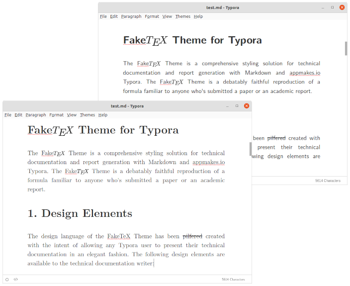

# FakeTeX Theme for Typora

*Because a reasonable LaTeX distribution weighs over 10GB*

---

FakeTeX is a theme for Typora inspired by LaTeX's default output and based on the [Academic Theme](https://github.com/typora/typora-theme-gallery/blob/gh-pages/media/theme/academic/academic.zip). The theme comes in two variants, Roman and Sans, and uses the [Latin Modern](https://github.com/slashfoo/lmweb) family of fonts.

## Demo

See the test PDFs for the [Roman](https://github.com/jack23247/typora-enterprise-theme/blob/master/test.pdf) and for the [Sans]() variants.

## Install

#### Automated install:

1. `chmod +x install.sh && ./install.sh`

#### Manual install:

1. Open Typora and go to *File → Preferences → Appearance → Open Theme Folder*
2. Close Typora and copy `faketex.css`, `faketex-sans.css` and the `faketex` folder into the Typora Theme Folder
3. Open Typora and select *File → Preferences → Appearance → Theme → Faketex* or *Faketex Sans*

## Todo

Nothing, for now.

## Credits

| Who                                           | What                                                         |
| :-------------------------------------------- | :----------------------------------------------------------- |
| [appmakes.io](https://appmakes.io)            | [Typora](https://typora.io) [Academic Theme](https://github.com/typora/typora-theme-gallery/blob/gh-pages/media/theme/academic/academic.zip) |
| [Jamiel Almeida](https://github.com/slashfoo) | [lmweb](https://github.com/slashfoo/lmweb)                   |

The `lmweb` project is a dependency of `typora-faketex-theme` and is released under a different license. Please read [`lmweb/LICENSE.md`](https://raw.githubusercontent.com/slashfoo/lmweb/master/LICENSE.md) for further details.

